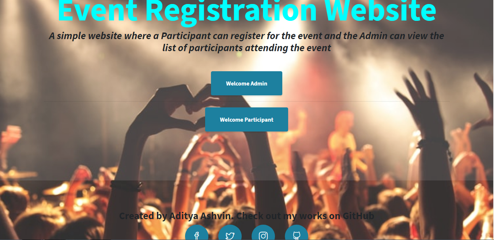
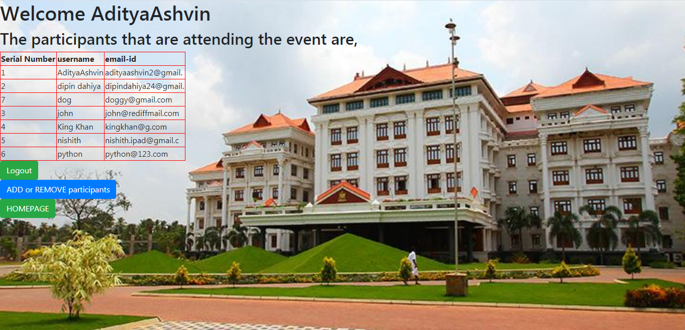
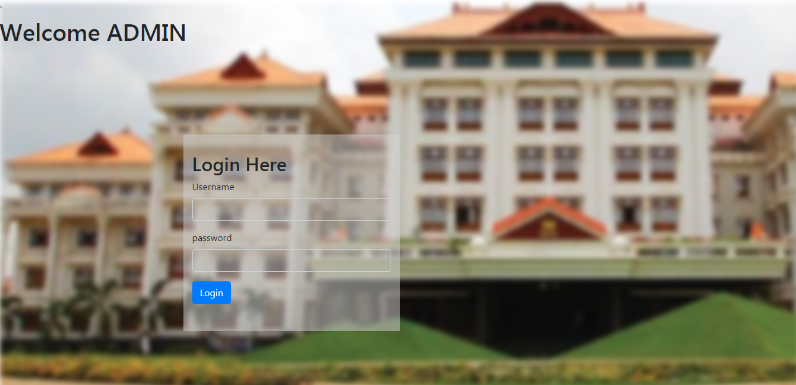
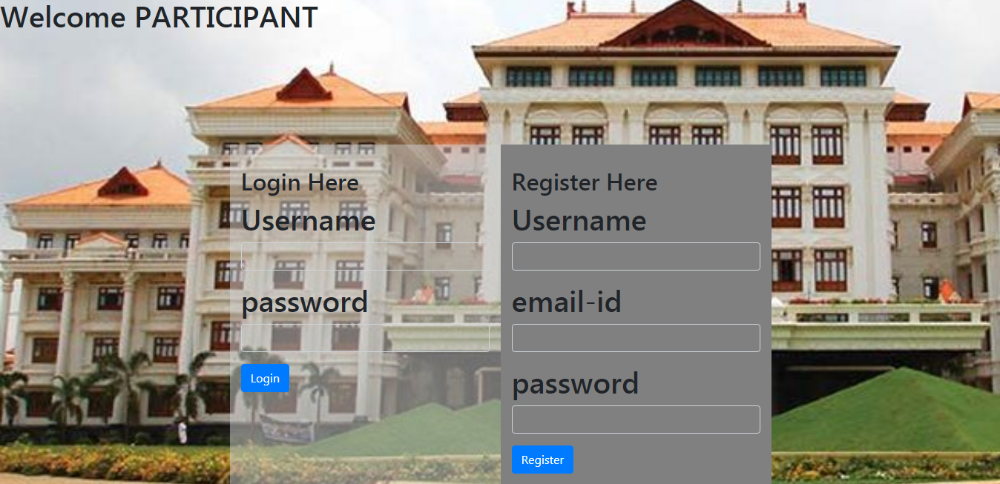

# amFOSS-project[Event Registration Website]
## 2.0 https://github.com/AdityaAshvin/Event_Registration_website
# Overview of the Project
> The project consists of the following pages
>- A Landing page.
>- Admin Login page.
>- Participant Registration and Login page.
>- Participant dashboard.
>- Admin dashboard.
# Getting Started
These instructions will get you a copy of the project up and running on your local machine for development and testing purposes.
> ## Prerequisites
> First you need to install xampp.
>- download xampp here [Xampp download for windows, mac os and ubuntu](https://www.apachefriends.org/download.html)
> Steps to install and setup xampp:-
>- [For Windows](https://pureinfotech.com/install-xampp-windows-10/)
>- [For Mac OS](https://www.webucator.com/how-to/how-install-start-test-xampp-on-mac-osx.cfm)
>- [For Ubuntu](https://vitux.com/how-to-install-xampp-on-your-ubuntu-18-04-lts-system/)
> If you don't want to use xampp you can also use, 
>- [WAMP](https://www.instructables.com/id/Installing-WAMP-Server/) 
>- [LAMP](https://medium.com/better-programming/how-to-install-lamp-stack-on-ubuntu-db77ac018116) For Ubuntu
>- [LEMP](https://www.google.com/amp/s/websiteforstudents.com/how-to-install-lemp-on-ubuntu-16-04-18-04-18-10/amp/) 
>- [MAMP](https://documentation.mamp.info/en/MAMP-Mac/Installation/) For Mac OS
>- AMPPS
>- WPN-XM
>- EasyPHP
>- Final Words

> ## Running the project in your local machine
>- Clone the project to your local machine using the given code in the Git terminal.
> **git clone https://github.com/AdityaAshvin/amFOSS-project.git**
>- Then Copy this file to the ***httdocs*** folder in the ***xampp*** folder.
>- Check whether MySQL and Apache are up and running.
>- Then open ur browser and type **http://localhost/amFOSS-project/LandingPage.html**
>- For a better and neater UI use **http://localhost/amFOSS-project/index.html**
> ## Working with phpMyadmin
>- Open your browser and paste this url *http://localhost/phpmyadmin/*
>- Create a database with name as **event_registration_admin**. Then create a list named as **lists** in the database. create three colums one each for ***username, email and password***.
>- Similarly create another database with name as **event_registration_participant**. Then create a list named as **lists** in the database. create four colums one each for ***indexnumber, username, email and password***.
>- Go to the ***user accounts*** settings and change the password for the **username-root and host name-localhost** to ***aditya@1234***(You can also create a new user with these username, host name and password)
>- You may encouter an error stating * acess denied for user root@localhost(using password:YES)* here to solve this issue you have to modify the ***config.inc.php*** file in the xamp folder. you just have to insert the password ***aditya@1234*** in the space enclosed by the double quotes.
>- Once you have done the above mentioned steps the project will be up and running in your local machine.

### LandingPage:-

### admin dashboard:-

### admin login page:-

### participant login and registration page:-

# Built with
>- PHP-Programming language
>- HTML-Programming language
>- CSS-Programming language
### Images taken from Google images.
## Created by Aditya Ashvin.
